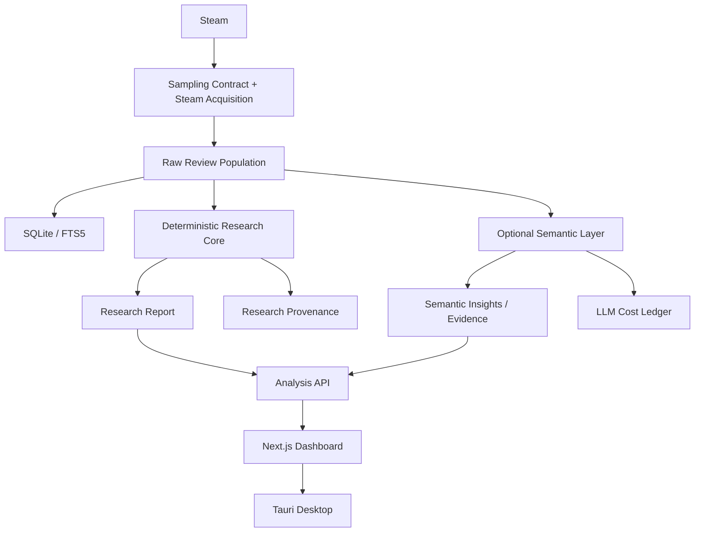

# STRA

## STRA — Evidence-Driven Player Insights & Version Research Workbench

STRA 是面向游戏研发、发行和运营团队的玩家反馈与版本研究工作台，将 Steam
评论转化为可量化、可追溯、可验证的产品洞察。它把 Steam 评论采集、确定性
Research Core、可选 LLM 语义分析、证据回溯和版本研究连接为一个工作流；LLM
不可用时，确定性的定量研究结果仍然有效。

## 1. 项目概览

STRA 面向游戏产品、用户研究和社区运营团队。它不是单纯的 Steam 情感分析
Dashboard，而是把玩家声音连接到产品动作的本地优先研究工作台。

## 2. 解决什么问题

- 最近发生了什么变化？
- 玩家为什么推荐或不推荐？
- 哪些玩家受到影响？
- 哪些问题真正值得优先处理？
- 应采取什么行动，之后如何验证？

## 3. 核心能力

- Sampling Contract 驱动的 Steam 评论采集与本地历史存储
- 确定性 Research Core：总体、来源、推荐率、模型假设下的不确定性和活动诊断
- 可选 LLM 多标签语义分类、话题/需求/正向信号提取
- 可回溯到原评论的 Evidence
- Five Questions 决策工作流与 FIX / IMPROVE / BUILD / AMPLIFY 行动框架
- Version Review V2：生命周期匹配、3/7/14 天窗口、覆盖门槛、话题变化和成对证据
- 每日推荐率 / 评论量 projection、provenance 与持久化 LLM cost ledger
- Tauri + Python sidecar 桌面应用

## 4. 产品工作流

1. 定义 Sampling Contract（时间、语言、推荐/购买类型、顺序和上限）。
2. 获取并保存目标 Steam 评论总体及 acquisition provenance。
3. Research Core 基于原始 Steam 元数据计算定量结果和数据有效性。
4. 若 Semantic Runtime 可用，再对文本执行语义分类和 Evidence 提取。
5. Dashboard 独立展示 Research Core 与 Semantic Layer。
6. Comparison / Version workflow 在明确的双总体研究设计下执行。

生产 `/analyze` 当前生成 `research-report-v1`、`mode=snapshot`。快照包括
Population / Sampling Contract、Recommendation Rate、Wilson 模型假设下的区间、
采集有效性、评论活动与重复/近似复制/集中表达诊断，以及限制和来源。快照不会
凭一个总体声称可比性、标准化、生命周期窗口稳健性或版本影响；这些需要第二个
明确的研究总体。

## 5. Version Review

Version Review V2 使用生命周期匹配窗口比较版本 A / 版本 B，而不是简单比较两个
任意日期区间。Version Review 仍是单独的比较工作流；其迁移到新的 Research Core
comparison contract 的部分，以当前实现为准，不把历史案例数字视为所有运行的默认结果。

| 指标 | 上一窗口 | 当前窗口 |
|---|---:|---:|
| 原始评论量（历史案例） | 831 | 1,573 |
| 推荐率（历史案例） | 55% | 75% |
| 推荐率变化 | — | +19.2 个百分点 |
| 语义比较样本（历史案例） | 831 | 1,000 |
| 成功分类（历史案例） | 831 | 768 |

系统可展示覆盖门槛、话题 delta、成对证据和稳健性窗口，结果用于提出可能机制，
不声称因果归因。

## 6. Research Core 与 Semantic Layer

### Research Core

- 确定性、provider-independent、可复现；拥有 population、Sampling Contract、acquisition provenance、Recommendation Rate、不确定性和活动/表达诊断。
- 对相同原始总体和配置生成相同的 Research Report。

### Semantic Layer

- 可选、LLM/provider-dependent；负责 topics、issues、requests、labels、evidence 和 semantic summaries。
- 可以 unavailable 或 failed，而不会使成功的 Research Core 失效。每次调用写入 cost ledger，记录 token、缓存、重试、延迟和估算成本。

## 7. 数据可信性设计

Steam 评论者是自选择样本，且不代表全部玩家。`voted_up` 表示 Recommended / Not
Recommended，不是文本 sentiment、总体玩家满意度或所有玩家的意见。
Recommendation Rate 不是 general satisfaction；Wilson 区间也不解决 Steam reviewer
self-selection。重复文本不自动等于 spam；集中表达不证明操纵；活动峰值不自动等于
review bombing。没有精确 population provenance 的历史运行不会伪造每日 projection；
缺失能力保持 unavailable，而不是补成 0。

## 8. 技术架构

Research Core does not depend on LLM. Readiness is deliberately split:

- Research READY + Semantic READY → full quantitative and semantic analysis;
- Research READY + Semantic UNAVAILABLE → valid quantitative product with a non-blocking notice;
- Research READY + Semantic FAILED → valid quantitative product with a semantic failure notice;
- Research unavailable → not Research-ready.

## 9. 实际案例

当前迁移后的历史数据包含 20,806 条 Steam 评论、4,325 条 review labels、13 次 analysis
runs、6 次完成的 general analysis、2 次完成的 Version Review，以及 1,142 条 LLM calls
ledger 记录。这些是历史迁移/示例数据，不代表每个运行环境的当前运行时总量。

一次真实 provenance acceptance 使用精确 100 条评论，覆盖 3 个 UTC 日 bucket；每日评论量
reconciled 到 100，推荐 numerator reconciled 到 91，实际 token 127,047，记录成本约
$0.0217，retry 为 0，失败 provider call 为 0。

## 10. 项目成果

- 建立可回退的冻结 MVP 与桌面历史数据迁移流程
- 将评论、运行、指标、证据和版本比较连成可复核链路
- 在不重跑历史分析的情况下恢复桌面端历史数据
- 交付可安装的 STRA 桌面包与本地优先运行环境

## 11. 已知边界

- 不能将 Steam 观察性数据解释为因果证明；association 不是 causation。
- Steam reviewers 是自选择样本，且不代表全部玩家。
- Recommendation Rate 不等于总体满意度；推荐/不推荐不是文本情感。
- Wilson 区间不校正 reviewer self-selection。
- 细粒度 taxonomy 标签是候选发现信号，应结合原文复核。
- 没有准确来源或时间序列时，projection 会显示 unavailable。
- 外部 Steam 能力不可用时，页面显示明确 unavailable 状态，不生成假数据。

## 12. 如何运行 / Demo

作品集 Demo 建议直接使用已构建的桌面安装包：[STRA_0.8.2_x64-setup.exe](apps/desktop/src-tauri/target/release/bundle/nsis/STRA_0.8.2_x64-setup.exe)。

开发环境需要 Python、Node.js、Rust/Tauri 和本地 SQLite。详细 60–90 秒演示流程见
[STRA_DEMO_SCRIPT.md](STRA_DEMO_SCRIPT.md)，案例讲解见 [STRA_INTERVIEW_CASE_STUDY.md](STRA_INTERVIEW_CASE_STUDY.md)。

## 13. 阶段状态

| Stage | Status |
|---|---|
| Sampling / Acquisition | Accepted |
| Population Validity | Accepted |
| Recommendation Inference | Accepted |
| Standardization / Window Robustness | Accepted for comparison workflows |
| Activity Diagnostics | Accepted |
| Research Core Snapshot | Accepted |
| Production Integration / Persistence / API | Accepted |
| Research Dashboard / E2E Product Acceptance | Accepted |
| External Event Timeline (Stage 2F) | Deferred |
| Semantic Sampling (Stage 3A) | Deferred |

The deterministic Stage 1–2P foundation is frozen for Stage 3 consumption. Stage 3 starts
from the raw Research population plus its immutable Research Report; a future semantic sample
is not the population and must carry separate sampling provenance.
