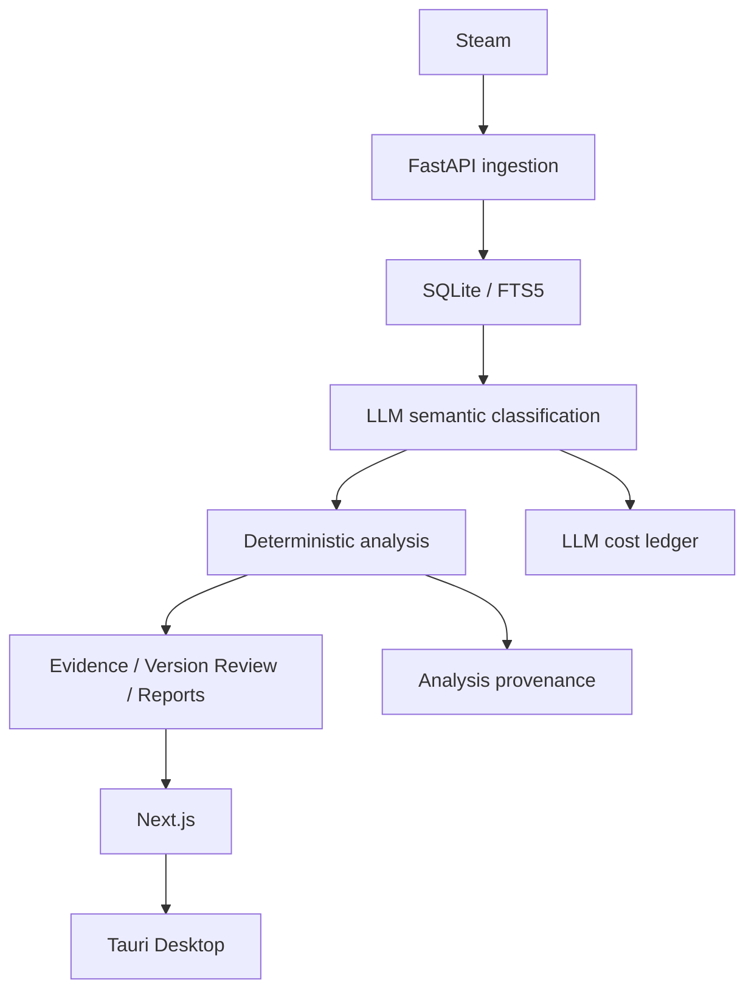

# STRA

Steam 玩家反馈与版本变化智能分析工具。STRA 将评论采集、LLM 语义分类、确定性指标、证据回溯和版本对比连成一条工作流，帮助快速回答：玩家为什么满意或不满意，哪些问题值得优先处理，以及下一步如何验证。

## 1. 项目概览

STRA 面向游戏产品、用户研究、社区运营和 AI 工具场景。它不是单纯的 Steam 情感分析 Dashboard，而是把玩家声音连接到产品动作的本地优先分析工作台。

## 2. 解决什么问题

- 最近发生了什么变化？
- 玩家为什么满意或不满意？
- 哪些玩家受到影响？
- 哪些问题真正值得优先处理？
- 应采取什么行动，之后如何验证？

## 3. 核心能力

- Steam 评论采集与本地历史存储
- LLM 多标签语义分类、话题/需求/正向信号提取
- 确定性推荐率、评论量、趋势与分群指标
- 可回溯到原评论的 Evidence
- Five Questions 决策工作流与 FIX / IMPROVE / BUILD / AMPLIFY 行动框架
- Version Review V2：生命周期匹配、3/7/14 天窗口、覆盖门槛、话题变化和成对证据
- 每日推荐率 / 评论量 projection、provenance 与持久化 LLM cost ledger
- Tauri + Python sidecar 桌面应用

## 4. 产品工作流

1. 选择 Steam 游戏并获取目标评论窗口。
2. 将评论写入本地 SQLite / FTS5 存储。
3. 对语义样本进行 LLM 多标签分类，并保存运行 provenance。
4. 用确定性逻辑生成指标、趋势、问题、需求和玩家分群。
5. 从 Dashboard、Evidence、Reports 和 Version Review 进入决策与复核。

## 5. Version Review

Version Review V2 使用生命周期匹配窗口比较版本 A / 版本 B，而不是简单比较两个任意日期区间。已验收的 HELLDIVERS 2 案例为：

| 指标 | 上一窗口 | 当前窗口 |
|---|---:|---:|
| 原始评论量 | 831 | 1,573 |
| 推荐率 | 55% | 75% |
| 推荐率变化 | — | +19.2 个百分点 |
| 语义比较样本 | 831 | 1,000 |
| 成功分类 | 831 | 768 |

系统同时展示覆盖门槛、话题 delta、成对证据和稳健性窗口，结果用于提出可能机制，不声称因果归因。

## 6. 数据可信性设计

Steam 评论是观察性、自选择数据；推荐率不是 sentiment。LLM confidence 不是模型 accuracy，Evidence Grade 反映观察性证据质量。没有精确 population provenance 的历史运行不会伪造每日 projection；缺失能力保持 unavailable，而不是补成 0。

## 7. AI / LLM 使用方式

LLM 负责受约束的语义分类和有限的 synthesis；确定性代码负责 population、分母、趋势、覆盖和比较逻辑。每次调用写入 cost ledger，记录 token、缓存、重试、延迟和估算成本。原始评论与证据 provenance 保留在本地。

## 8. 技术架构

## 9. 实际案例

当前迁移后的历史数据包含 20,806 条 Steam 评论、4,325 条 review labels、13 次 analysis runs、6 次完成的 general analysis、2 次完成的 Version Review，以及 1,142 条 LLM calls ledger 记录。

一次真实 provenance acceptance 使用精确 100 条评论，覆盖 3 个 UTC 日 bucket；每日评论量 reconciled 到 100，推荐 numerator reconciled 到 91，实际 token 127,047，记录成本约 $0.0217，retry 为 0，失败 provider call 为 0。

## 10. 项目成果

- 建立可回退的冻结 MVP 与桌面历史数据迁移流程
- 将评论、运行、指标、证据和版本比较连成可复核链路
- 在不重跑历史分析的情况下恢复桌面端历史数据
- 交付可安装的 STRA 桌面包与本地优先运行环境

## 11. 已知边界

- 不能将 Steam 观察性数据解释为因果证明。
- 推荐率不改名为 sentiment。
- 细粒度 taxonomy 标签是候选发现信号，应结合原文复核。
- 没有准确来源或时间序列时，projection 会显示 unavailable。
- 外部 Steam 能力不可用时，页面显示明确 unavailable 状态，不生成假数据。

## 12. 如何运行 / Demo

作品集 Demo 建议直接使用已构建的桌面安装包：[STRA_0.8.2_x64-setup.exe](apps/desktop/src-tauri/target/release/bundle/nsis/STRA_0.8.2_x64-setup.exe)。

开发环境需要 Python、Node.js、Rust/Tauri 和本地 SQLite。详细 60–90 秒演示流程见 [STRA_DEMO_SCRIPT.md](STRA_DEMO_SCRIPT.md)，案例讲解见 [STRA_INTERVIEW_CASE_STUDY.md](STRA_INTERVIEW_CASE_STUDY.md)。
